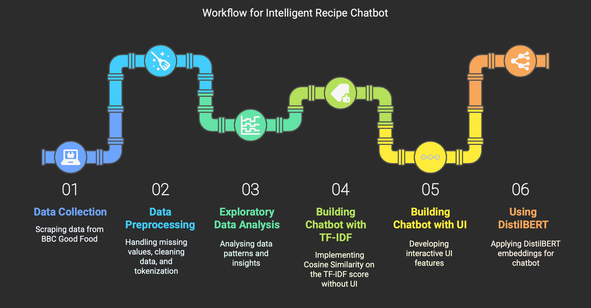

# AI Cooking Assistant Chatbot

This project is an AI-powered chatbot that recommends recipes based on user preferences, combining both keyword-based and semantic search techniques. It was developed to demonstrate the integration of classic TF-IDF models with modern transformer-based models like DistilBERT.

---

## Project Summary

- **Objective:** Create a chatbot that helps users discover meals based on natural language input.
- **Domain:** Recipe recommendation
- **Techniques:** TF-IDF + Cosine Similarity, DistilBERT Embeddings
- **Interface:** Interactive GUI using Tkinter

---

## Features

- Beautiful Soup to scrape recipes from BBC Good Food
- Dropdown menu for selecting recipe categories (e.g., healthy, vegetarian)
- Free-text user input for natural interaction (e.g., “I want a quick high-protein dinner”)
- Two recommendation engines:
  - **TF-IDF**: Keyword-based similarity
  - **DistilBERT**: Semantic understanding
- “Surprise Me” button for random top-rated recipe
- Cooking-themed loading animation
- Right-hand recipe panel with:
  - Title
  - Ingredients
  - Instructions

---

